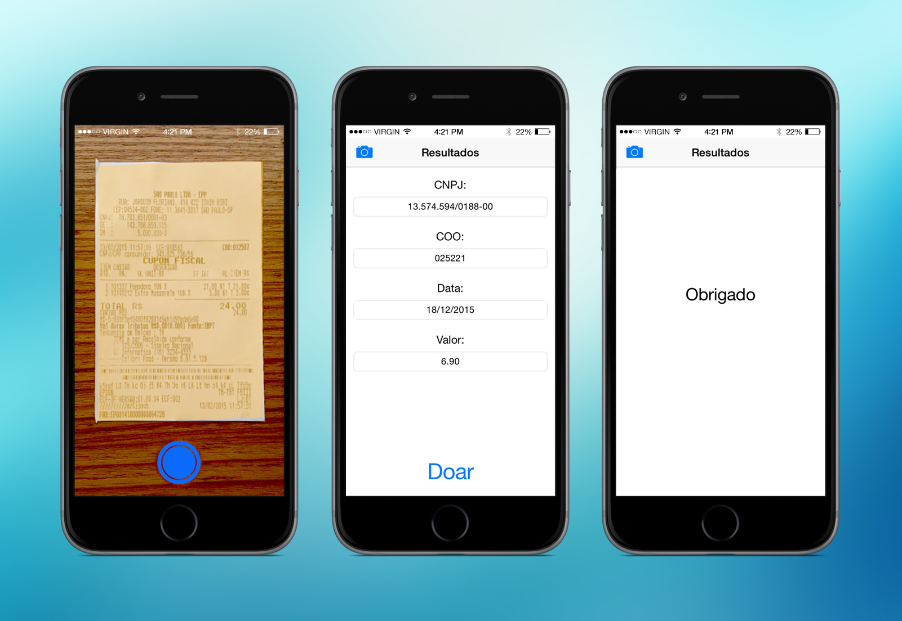
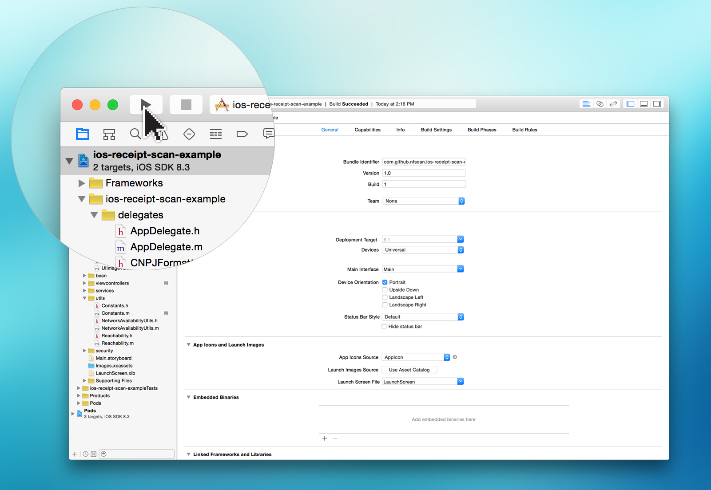

# ios-receipt-scan-example 
[](https://travis-ci.org/nfscan/ios-receipt-scan-example) [](https://raw.githubusercontent.com/nfscan/ios-receipt-scan-example/master/LICENSE)

Simple iOS client [white label](https://en.wikipedia.org/wiki/White-label_product) for [nfscan](https://github.com/nfscan/nfscan) 



## Usage

**1)** Download the repository

```
$ git clone https://github.com/nfscan/ios-receipt-scan-example.git
$ cd ios-receipt-scan-example
```
    
**2)** Run CocoaPods

```
$ pod install
```

**3)** Open the project in Xcode

```
$ open ios-receipt-scan-example.xcworkspace
```

**4)** Change nfscan service address on [Constants.m](https://github.com/nfscan/ios-receipt-scan-example/blob/master/ios-receipt-scan-example/Constants.m)

```Objective-C
+(NSString*) HOST{
    static NSString* baseUrl;
    static dispatch_once_t onceToken;
    dispatch_once(&onceToken, ^{
        NSDictionary *env = [[NSProcessInfo processInfo] environment];
        NSString *overrideBaseUrl = [env valueForKey:@"BASE_URL"];
        if(overrideBaseUrl && ![overrideBaseUrl isEqualToString:@""]){
            baseUrl = overrideBaseUrl;
        }else{
#ifdef DEBUG
            NSLog(@"%s BASE_URL ENVIRONMENTAL VARIABLES ISN'T SET",__PRETTY_FUNCTION__);
#endif
            baseUrl = @"http://youripaddress:8080/nfscan-server/";
        }
    });
    return baseUrl;
}
```

5) Compile and run the app in your simulator



# Requirements

- Xcode 6.3
- iOS 8

# Credits

- [AFNetworking](https://github.com/AFNetworking/AFNetworking) for network request
- [MBProgressHUD](https://github.com/jdg/MBProgressHUD) for progress indicator
